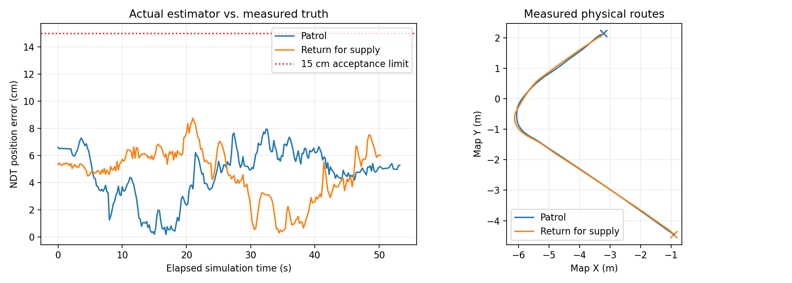

<!-- 文件用途：提供六项自主导航仿真队会汇报提纲和真车前交接清单。 -->
# 五页队会汇报提纲

## 第 1 页：这一轮完成什么

一句话：机器人现在能在自建场地中，使用实际雷达和 NDT 定位，
由真实决策节点下发目标，经规划、MPC 和真实 MCU 串口程序驱动物理底盘到点。

六项主线：自动跟踪、安全异常、动态重规划、实际定位、通用底盘动力学、完整系统联调。
与第二阶段相比，从“生成路径”推进到“实际闭环行驶并停车”。

## 第 2 页：整条系统怎么连起来

模拟裁判字节 → 真实 MCU 解码 → 决策目标 → 规划 → MPC → 安全保护 →
真实 MCU 编码 → PTY 接收解码 → Gazebo 力驱动底盘 → 真实雷达 → NDT → 反馈控制。

真值只在验收工具里算误差；运行节点不拿真值替代定位。
参考 [完整系统接口](完整系统接口.md) 中的系统图。

## 第 3 页：最有说服力的三组结果

- 五组路线各跑三次：15/15 到点，最大终点误差 11.72 cm，全部参考和实际运动通过占据审计。
- 完整物理加串口往返：终点误差 4.84 / 6.55 cm，定位峰值 7.94 / 8.76 cm；
  541 个运动导航帧抽样全部与实际安全输出相符。
- 通用物理模型：实测重力 9.81 m/s²，主动制动距离 4.71 cm；真实撞墙和 5° 坡道通过。

## 第 4 页：故障与运行成本

- 比赛结束、错误裁判 CRC、实际 MCU 挂起都能停车；进程恢复不续跑旧目标。
- 真实 MCU 挂起停车 0.56 s；错误裁判帧停车 1.11 s；手动接管正常。
- 完整系统双窗口 310 s：平均实时率 0.853，RSS 峰值 2.05 GiB，雷达 5 Hz，
  CPU 约 361.5% 单核口径，即四核约 90.4%。
- 暂停后时钟不推进；恢复的实际制动位移 2.71 cm，旧目标保持取消。

[95 秒演示视频](full-demo.mp4) 为真实 Gazebo/RViz 窗口录制。截图、原始数值、失败记录均在本目录。
完整退出与重启已通过：7 个关键发布者 1 → 0 → 1，旧子进程无残留，重启一辆车且不自行运动。

## 第 5 页：发现的问题与下一步

这一轮实际修复了初速度坐标、拓扑路径越障边界、动态占据遗漏、
重复到达反馈导致的巡逻点快速切换，以及 NDT 邻域搜索精度问题。
没有把失败的数据改成通过；报告保留调参与失败过程。

接真车前需要：

1. 提供底盘形式、质量、轮距/轴距、轮径、减速比、转动惯量和电控速度单位/坐标。
2. 台架验证 MCU 协议、急停、指令超时、电控失联和重连；PTY 不能代替电控板验收。
3. 标定雷达/IMU 外参，使用真实噪声与时间同步；再决定 NDT、Point-LIO 或融合方案。
4. 重新标定速度、加速度、制动距离和跟踪器代价；通用全向力模型不能替代真实轮胎/电机。
5. 补测未知起点重定位、真实动态人群、坡道定位、长时运行及目标朝向判据。
6. 将真实比赛行为、射击与裁判链路逐项接入；本轮完整联调重点是导航链路。

汇报措辞：六项仿真各有实际证据；仍不等于真车验收、完整比赛验证或场地三维还原。

演示：[95 秒实际完整系统录屏](full-demo.mp4)，录制期间实际到点和空间审计通过。
