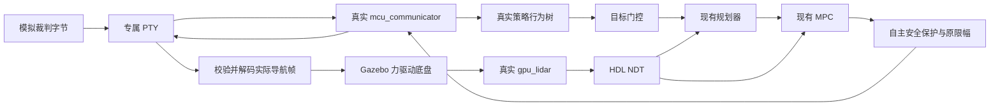

<!-- 文件用途：说明完整仿真的实际导航、裁判和串口链路，区分运行输入与验收真值。 -->
# 完整系统接口与运行边界

入口：`bash scripts/gazebo_full.sh`。已有实例切换使用 `bash scripts/gazebo_full.sh restart`。
该入口强制启用实际 NDT 定位和接触动力学底盘，不接受真值定位作为完整联调配置。



## 可操作命令

在启动环境已 source 的 Ubuntu 终端中使用 ROS domain 26：

```bash
cd /home/liangys/RM_Sentry_2026
bash scripts/gazebo_full.sh build
bash scripts/gazebo_full.sh
```

另开终端：

```bash
source /opt/ros/humble/setup.bash
source ros2_ws/install_closure_fix/local_setup.bash
source ros2_ws/install_sentry_autonomy/local_setup.bash
export ROS_DOMAIN_ID=26 ROS_LOCALHOST_ONLY=1
# 先进入自动，再由真实串口裁判帧触发巡逻。
bash scripts/gazebo_full.sh auto
ros2 topic pub --once /sim/referee/scenario std_msgs/msg/String '{data: patrol}'
# 低血量场景：真实 MCU 解码 HP=80，策略改去补给点。
ros2 topic pub --once /sim/referee/scenario std_msgs/msg/String '{data: supply}'
# 比赛结束：HP 恢复为默认值，game_progress=0，停止自动运动。
ros2 topic pub --once /sim/referee/scenario std_msgs/msg/String '{data: stop}'
```

手动接管：`bash scripts/gazebo_full.sh keyboard`。
立即停止运动：`bash scripts/gazebo_full.sh stop`。
结束全部进程：启动终端 Ctrl+C。完整重启：`bash scripts/gazebo_full.sh restart`。
重新启动默认处于裁判 stop 场景；重新选择 auto 并发送巡逻场景才开始运动。
从故障锁停或手动接管重新进入决策巡逻时，先发送 stop 裁判场景，
再选择 auto 并发送 patrol；持续相同的比赛/目标电平不会被解释为新的运动授权。

`SENTRY_DEPENDENCY_SETUP` 可指定已构建依赖安装目录。新机器依赖准备仍按工作区 README，
本机的 install_closure_fix 是既有构建产物，不随 Git 分发。

## 运行接口

| 接口 | 类型 / 责任 |
|---|---|
| /sim/referee/scenario | String：stop、patrol、supply、corrupt_referee，仅选择写入 PTY 的裁判字节 |
| /referee/game_progress、/robot/self_hp 等 | 真实 MCU 程序从实际串口字节解码后发布 |
| /sim/decision_goal | PointStamped：真实行为树目标，map 坐标 |
| /goal → /sim/planner_goal | PoseStamped：经模式、时间、传感器和裁判状态检查后送入规划器 |
| /sim/planned_trajectory → /global_trajectory | TrajectoryPoly：参考经过速度、加速度、占据检查后才进入跟踪 |
| /sim/auto_cmd_vel | Twist：现有 MPC 的 base_link 速度，由 hit_bridge 转发 |
| /cmd_vel → /sim/guarded_cmd_vel | 唯一安全输出，经原有限幅与超时保护 |
| /sim/serial_cmd_vel | Twist：唯一来源为 PTY 收到的实际 MCU HK 导航帧，经 CRC 与量程检查后解码 |
| /sim/mcu/status | JSON String：拥有的 PTY、真实 MCU PID、已解码帧计数、最近导航帧十六进制 |
| /filted_topic_3d | 真实 lidar 测量，经固定外参变换到 base_link；保留原始时间戳 |
| /sim/ndt/odometry、/sim/ndt/status | 真实 HDL/NDT 的原始估计和匹配质量，仅供定位适配 |
| /localization/odometry | 唯一发布者 estimated_odometry；map 位姿、由估计位姿差分得到的 base_link 速度 |
| /aligned_points | 原始测量时刻的 map 点云；缺该时刻 TF 就丢弃 |
| /sim/arrived → /dstar_status | 保护节点确认位置和估计速度稳定后，向真实决策节点反馈到达 |
| /sim/ground_truth/odometry | 仅验收工具订阅，运行中的定位、控制、决策均不使用 |

TF 唯一链为 map → odom → base_link → lidar_link；HDL 自身 TF 关闭。
全部运行节点显式使用仿真时间。安全看门狗使用墙钟，暂停时仍能停车。

## 安全约束

- PTY 由当前进程创建，只能是其拥有的 /dev/pts/*，没有物理串口参数。
- Gazebo 完整配置只订阅 /sim/serial_cmd_vel；不保留绕开真实 MCU 的直接桥接路径。
- 连续 0.3 秒未收到有效导航字节，PTY 模拟器输出零；原生力驱动还保留独立 0.5 秒命令看门狗。
- 自动模式要求裁判状态为比赛中，且最近 0.8 秒有真实 MCU 解码的裁判反馈。
- 错误 CRC 不更新有效裁判状态；恢复串口后不重放已经取消的旧目标。
- 行为树反复发布同一个目标不会重置规划；到达电平连续为真也只推进一个巡逻点。
- 原生时间回拨进入锁停，需要完整重启；不承诺原地回拨恢复传感器时序。
- 力驱动通过有限力/力矩积分运动，暂停恢复和停车都有物理制动距离。

## 验证边界

这里验证导航相关的真实策略、规划、MPC、NDT 与 MCU 可执行程序互联。
MCU 的另一端是软件 PTY 与模拟底盘，不是电控板；运动模式字节被解析记录，
没有实现射击、电机电流、比赛裁判无线链路或真实弹药/补血物理过程。
场地障碍是规划地图二维轮廓挤出；底盘为通用全向力驱动刚体。
真实轮系、驱动器、雷达噪声及未知初始位置重定位仍需要真车数据与独立验收。
