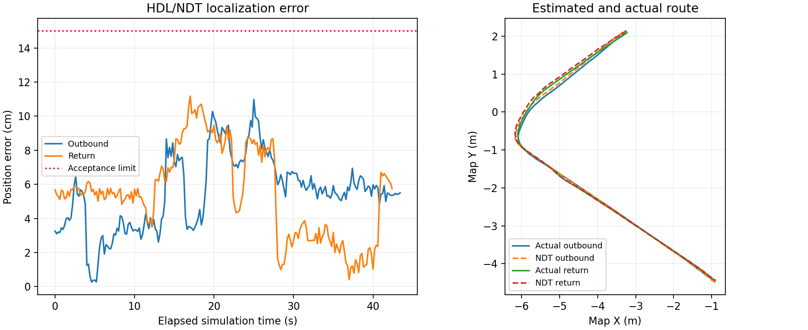
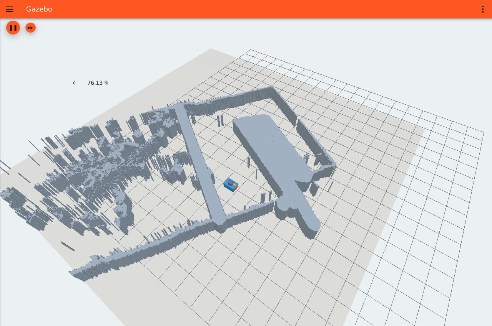
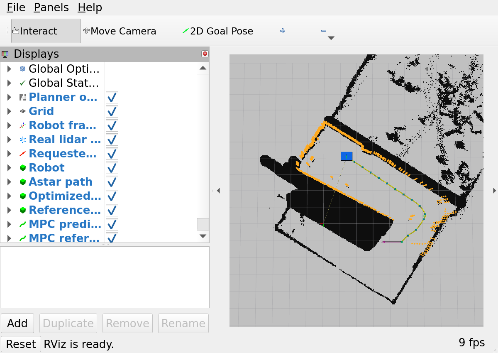

<!-- 文件用途：归档六项后续仿真的实际验收、失败记录与交接边界；未验收项不计为完成。 -->
# 六项后续仿真验收报告

基线为 PR #10 合并后的 4210fa7；实施分支 feat/20260926-sentry-sim-autonomy。
环境为 Ubuntu 22.04 / ROS 2 Humble / Gazebo Fortress，VMware 4 vCPU，llvmpipe 软件渲染。
命令、接口与当前入口见 [实施记录](README.md)。

## 验收矩阵

| 顺序 | 内容 | 实测状态 | 证据 |
|---|---|---|---|
| 1 | MPC 自动跟踪 | 最终源码 15/15 闭环通过，90° 朝向复核通过 | evidence/closed-loop-final-source-15.json、closed-loop-final-yaw90.json |
| 2 | 安全异常与接管 | 9 项真实故障、完整重启及原场景 34 项通过 | evidence/live-safety-supported-reset.json、autonomy-restart-cli-window-fixed.json |
| 3 | 移动中换目标、真实动态障碍 | 四项实际场景通过，空间审计通过 | evidence/dynamic-motion-audit.json |
| 4 | 实际定位算法 | CPU HDL/NDT 往返闭环、误差和故障恢复通过 | evidence/ndt-routes-fine.json、ndt-fault-recovery.json |
| 5 | 通用底盘物理 | 8 项接触动力学、制动和坡道测试通过；真车参数尚未提供 | evidence/physics-final-summary.json |
| 6 | 完整系统及模拟 MCU | 真实策略/MCU 往返、串口故障、暂停、310 秒性能与完整重启通过 | evidence/full-kdtree.json、full-faults-kdtree.json、full-lifecycle.json |

## 第一项：实际跟踪

采用既有 MPC，真值定位、真实 gpu_lidar、受保护的唯一速度出口。
目标位置误差 <=0.15 m，并要求实测速度稳定停车 0.5 秒。
保持出发航向，不宣称完成目标朝向跟踪。
简单速度模型无接触动力学；碰撞检查是平面占据检查，物理碰撞另列第五项。

自主配置降低期望速度至 0.3 m/s，MPC 输出 <=0.45 m/s。
生产障碍软代价仍为 20，自主低速配置使用 1；用独立占据检查约束参考与预测。
规划余量采用 0.45 m，验收仍使用原地图生产膨胀规则。
五组实际路线每组重复三次，固定规划随机种子 7，机器人只在每次测试前停止后复位。

### 已完成测量

最终 15 次：累计 577.16 秒，最大终点误差 0.1172 m，最大横向偏差 0.0374 m，
最大速度 0.4202 m/s。最终 90° 朝向复核：49.42 秒、误差 0.1138 m。
15 次参考多项式及实测位置插值均通过空间审计。以下早期专项和性能数据分别保留版本。

- 反向单路线：40.77 秒；终点误差 0.1142 m；最大横向偏差 0.0292 m。
- 90° 初始朝向：41.64 秒；终点误差 0.1142 m；最大横向偏差 0.0345 m。
- Gazebo / RViz 同时可见运行 310 秒：平均 RTF 0.9974，最低采样 RTF 0.9805；
  RSS 峰值 1674.8 MiB；CPU 平均 340.3%（一核口径，四核约 85.1%）；点云 5.0 Hz。
  见 evidence/tracking-terminal-fixed-performance.json。该记录不包含尚未接入的实际定位算法。
- 9 项规划回归、12 项安全契约通过。ROS 域 28 / 29 的人工输入仅用于接口和异常测试，
  不作为传感器真实性或实际运动证明。

### 失败与修复，不隐去失败样本

1. 0.2 秒自主时钟判据对软件渲染抖动过敏；调整为 0.5 秒，保留原下游暂停保护。
2. 每帧点云触发重规划，使参考时钟不断重启。改为路径受阻才触发，保留显式重规划请求。
3. 低速 MPC 在软障碍代价 20 下停滞。自主配置调为 1，并增加空间安全检查。
4. 首轮批量第 11 次出现参考及实际占据区样本：该轮失败。增加规划余量，
   重锚定裁剪检查、参考准入和预测检查，重新完整验收。
5. 反向拓扑端点接入失败：修正端点连接、包含终点的半栅格可见性检查、零距离除法和浮点代价。
6. ROS2 适配器缺失拓扑采样中心更新：源码已补齐；最终版本 15/15 重跑通过。
7. 一次回归启动误加载旧 underlay 动态库；使用当前 overlay 并核对 ldd 后通过。
8. 一次暂停契约使用秒浮点重建纳秒时间，造成“时钟变化”误判；改为固定同一纳秒时间值后通过。

## 安全与未完成边界

自动回到 auto 模式不能恢复旧目标；需重新发目标。错误轨迹、超时、暂停均清空跟踪参考。
当前验收还未覆盖实际定位误差、真实车轮结构、真实 MCU、电机与比赛场地完整三维地形。
后续每项必须补充实测命令、原始数据、失败记录与结论，再改变矩阵状态。

## 复现及停止

~~~bash
cd /home/liangys/RM_Sentry_2026
bash scripts/gazebo_autonomy.sh build
bash scripts/gazebo_autonomy.sh
# 另一终端：keyboard / auto / stop
bash scripts/gazebo_autonomy.sh stop
~~~

启动终端 Ctrl+C 结束整套进程；测试工具仅操作已校验的本次 launch 后代进程。
证据录制未占用用户鼠标。

## 第二项：安全异常与生命周期

9 项真实场景故障注入通过，见 evidence/live-safety-supported-reset.json：
点云丢失、控制器挂起、定位适配器挂起、ROS/Gazebo 桥挂起、安全节点挂起、
暂停恢复、手动接管、不可达替代目标、时间回拨锁停。
前三项停车状态延迟分别约 0.717 / 0.706 / 0.663 秒；停车后测得位移均为零。
桥挂起时独立使用 Ignition 原生里程计测得速度和位移均为零。
14 项隔离安全契约和 3 项启动里程计契约通过，合成输入不作为运动证据。

最初定位适配器挂起会让 Gazebo 保持最后速度，真实故障测试失败。
在 Gazebo 原生插件增加 0.5 秒墙钟指令看门狗，独立于 ROS 适配器；
安全节点恢复运行时也清除旧轨迹。修复后的整套故障测试通过。
原简单场景 34/34 回归通过，包含实际键盘、限幅、超时停车、暂停恢复和 50 Hz 真值反馈；
见 evidence/basic-regression/motion.json。

完整重启命令 `bash scripts/gazebo_autonomy.sh restart` 已实测：
五个关键话题发布者计数从 1→0→1，场景始终只创建一辆机器人，重启后无自主运动。
见 evidence/autonomy-restart-cli-window-fixed.json。
该命令仅停止已登记且 PID 创建时间、所有者和命令行均匹配的本仓库 launch。

启动时原生 OdometryPublisher 用原点计算非原点出生位置的首个差分，
并在十次物理更新的滚动平均中保留异常速度。实际位置未移动；
只丢首帧的首版修复仍失败。现在等待 0.2 秒仿真时间窗口，随后原样保留真实时间戳、
位置和速度，不用人工零速度替换测量。原始异常及修复前后记录均保留。

### 重置边界

支持暂停/恢复及完整进程重启；不支持原生时间回拨后继续同一传感器实例。
回拨必须锁定停车，auto 或新目标不能解除，完整重启才恢复。
Fortress Sensors 的下一采样时间及 TF 缓存使原位回拨恢复测试失败；
不以“没有移动”冒充“恢复可用”。失败记录见 reset-recovery-deep.json、
reset-recovery-epoch-fixed.json。相关依据：
[Fortress Sensors 源码](https://raw.githubusercontent.com/gazebosim/gz-sim/ign-gazebo6/src/systems/sensors/Sensors.cc)、
[原生里程计源码](https://raw.githubusercontent.com/gazebosim/gz-sim/ign-gazebo6/src/systems/odometry_publisher/OdometryPublisher.cc)。

第二项最终重启后闭环复核通过：47.90 秒到点，终点误差 0.1135 m，
最大横向偏差 0.0306 m，占据样本 0。见 evidence/closed-loop-step2-final.json。

## 第三项：移动中重规划

真实 Gazebo 场景四项通过：移动中换目标、新箱体绕行、箱体位置改变后绕行、整条通道封堵停车。
箱体通过 Gazebo create / set_pose / remove 服务控制，传感器返回来自实际 gpu_lidar。
箱体位置改变是受控离散位移，用于观察地图更新与重规划；不宣称模拟障碍动力学。

| 实测 | 结果 |
|---|---|
| 新箱体绕行 | 新轨迹 8 条，终点误差 0.1130 m，最小车体净空 0.2507 m |
| 箱体位移后绕行 | 新轨迹 8 条，终点误差 0.1140 m，最小净空 0.3281 m |
| 通道封堵 | 无新可执行轨迹，明确报告无有效路径，最小净空 0.1579 m，停车后位移 0 |
| 移动中换目标 | 新轨迹 6 条，到新目标误差 0.1117 m |

证据：evidence/dynamic-obstacle-guarded.json、dynamic-moving-box.json、
dynamic-road-blocked.json、moving-goal-change-final.json。
前三项实测位置按 <=0.02 m 插值复核，原生产占据区样本均为 0；
见 dynamic-motion-audit.json。插值不等于额外真实采样。

修正拓扑可见性、端点采样与路径剪枝忽略动态占据的问题，同时修复
当前位置在线段上的索引误用和碰撞终点未初始化的边界情况。
10 项规划回归和 15 项安全契约通过。
独立动态保护从实际 map 点云提取新增障碍，剔除距原始静态墙 <=0.10 m 的回波，
保留 1 秒观测，使用 0.40 m 圆形保护半径。它检查参考和 MPC 预测；
不安全时停车并请求当前目标的新路径，8 秒无安全路径则报告失败。
它没有读取测试箱体位置来构造点云或控制机器人。

最初代码已能绕过该箱体，但净空只有 0.0975 m，且部分全局搜索仍忽略动态障碍；
保留 baseline 数据，不用这一例通过代替完整保护。

## 第四项：实际定位算法

现有 HDL 的 CPU NDT_OMP 已替代真值定位接入导航；使用真实 360×4、5 Hz 雷达。
不启动 IMU/Point-LIO，关闭 HDL 的里程计运动预测和 TF 发布；
原始 NDT 输出在 /sim/ndt/odometry，专用适配器从估计位姿差分获得 base_link 速度，
唯一发布 /localization/odometry 和 odom→base_link。Gazebo 真值仅由验收工具读取。
运行图已核验上述三类运行节点均不订阅真值，见 ndt-routes-fine.json。

地图文件 maps/ndt_reference.pcd 从相同原始占据格的外露面和地面生成，含 424654 个点，
仅为定位参考地图；不会作为实时观测发布。生成器和 JSON 哈希一同提交。
body 点云在已知固定外参下立即发布，使定位能在无 map TF 时启动；
map 点云仍等待测量时刻 TF，超过 0.5 秒丢弃，不使用最新 TF。
实际雷达 intensity 字段被保留；参考地图 intensity=0 只是未建模属性。

### 实测与限制

使用 0.3 m NDT 分辨率、0.05 m 下采样、2 个 OpenMP 线程。
初始位置先验偏差约 0.18 m；本轮不是未知初始位置的全局重定位验收。
导航采用明确的平面约束（z/roll/pitch 不用于二维控制），原始三维估计仍保留供评估。

| 路线 | 实际终点误差 | 定位峰值误差 | 定位 RMS | 时间 |
|---|---:|---:|---:|---:|
| 去程 | 0.0624 m | 0.1098 m | 0.0594 m | 43.74 s |
| 回程 | 0.0675 m | 0.1118 m | 0.0605 m | 42.46 s |

两个方向全部已接受多项式及实际位置插值通过原占据图检查；
见 evidence/ndt-routes-fine.json、ndt-routes-audit.json。

真实 NDT 进程挂起后 0.466 秒停车，停车后位移 0，恢复进程不重放旧目标。
在静止时给估计位置增加 (0.15,-0.10) m 初始提示偏差，5 秒后误差恢复至 0.0217 m。
见 ndt-fault-recovery.json。5 项估计里程计契约、4 项点云启动/时间戳契约通过。

双 GUI 65 秒性能采样：平均 RTF 0.9998，RSS 峰值 1897.2 MiB，
CPU 平均 354.5%（单核口径），点云 5 Hz，全部进程存活。
这是定位集成的短时测量，不能替代第六项完整系统的 5 分钟验收。

### 失败记录

- 真值专用测试工具把估计定位当作精确出生位置检查，导致断言失败；
  新定位验收工具不再瞬移机器人，直接往返并按测量时刻独立比对。
- 0.5 m NDT / 0.1 m 下采样首轮虽到点，转角定位误差峰值 0.1512 m 超过 0.15 m 标准，
  该轮记为失败。调小分辨率后重新完整往返通过，保留 ndt-routes-first.json。
- 原始 HDL 在无 Point-LIO 时提示原始 twist 不可用；公共速度来自估计位姿差分，
  不复制这个零速度。差分的名义速度协方差不是实测统计协方差。

启动：`SENTRY_LOCALIZATION=ndt bash scripts/gazebo_autonomy.sh`。
切换已有实例：`SENTRY_LOCALIZATION=ndt bash scripts/gazebo_autonomy.sh restart`。
不设置环境变量时仍为原真值入口，便于回归对照。

## 第五项：通用底盘接触动力学

独立入口 `bash scripts/gazebo_physics.sh`（先退出其它仿真），
键盘入口 `bash scripts/gazebo_physics.sh keyboard`，启动终端 Ctrl+C 完整停止。
模型是明确标注的通用全向力驱动刚体：15 kg、0.7×0.5 m 车体、四个球形接触支点、
摩擦系数 0.02、最大驱动力 30 N、最大偏航力矩 2 N·m、2 ms 物理步长。
它不代表真实麦轮/舵轮结构、轮胎、减速器、电机或比赛场地三维还原；
获得真车参数后仍需识别和重新标定。

速度目标经过正常加速斜率限制，底层 PI 输出有限力/力矩，Gazebo 负责积分、重力与接触。
没有修改物理位姿或速度状态来实现运动。零指令和超时执行受限主动制动，
暂停恢复也依靠真实制动力消耗原有动量；不把物理惯性改写成瞬时静止。

| 最终实测 | 指标 |
|---|---|
| 自由落体与地面接触 | 拟合重力 9.81 m/s²；落地瞬时最大穿透约 6.5 mm |
| 正常加速 | 最高 0.3999 m/s，最大加速度 0.5123 m/s² |
| 摩擦负载 | 稳态驱动力 2.9435 N，与 0.02×15×9.81 一致 |
| 主动制动 | 从约 0.4 m/s 停车，距离 0.0471 m |
| 90° 朝向运动 | body +X 对应 world +Y，位移 0.4938 m；转向 0.3460 rad |
| 命令丢失 | 0.749 s 停止，继续行驶 0.2302 m（包含 0.5 s 超时窗口） |
| 适配器挂起 | 原生物理插件 0.766 s 停止，继续行驶 0.2316 m |
| 暂停恢复 | 时钟冻结；恢复后制动距离 0.0263 m，最终速度小于 0.001 m/s |
| 撞墙 | 车体中心最大 X=2.05031 m；墙面 X=2.4、车体半长 0.35，无穿墙 |
| 5° 坡道 | 实测俯仰 -5.0°，高度 0.2225 m；停车后速度为 0 |

八个测试用例的最终来源与通过状态见 evidence/physics-final-summary.json；
原始帧分别保存在 physics-final.json、physics-pause-corrected.json、
physics-brake-collision.json、physics-brake-ramp.json。测试设置位置时才使用 set_pose，
每项实测运动和坡道上升均来自真实物理状态。

### 失败和修复

- 最初落地检查误取了服务调用前排队的旧里程计；修正为从实际最高点拟合自由落体。
  10 ms 步长的接触穿透也偏大，降至 2 ms 后重新测量。
- 纯比例偏航控制受接触摩擦影响，转角不足；补充有限幅、抗饱和积分补偿后通过。
- 普通零指令使用加速斜率时停车需约 1.37 s，距离偏长；
  改为零指令触发主动制动，重新验收超时、接管看门狗、撞墙与坡道。
- 首次暂停复核把暂停服务尚未生效期间的移动也算入恢复位移；
  分别记录服务等待期移动 0.0728 m 和实际恢复制动 0.0263 m，不通过放宽标准来隐藏差异。

另将 NDT 参考地图生成纳入 CMake：干净构建自动生成模拟参考 PCD，
不依赖忽略的工作区文件。生成物与既有参考 SHA-256 完全一致。

## 第六项：实际策略、定位、控制、MCU 串口与物理底盘

独立入口为 `bash scripts/gazebo_full.sh`，启动与停止方法、全部接口见
[完整系统接口](完整系统接口.md)。它强制 NDT 定位与真实接触动力学。
仿真裁判帧通过专属 PTY 写入真实 mcu_communicator，解码后的裁判信息驱动原策略行为树；
目标经过保护进入既有规划器和 MPC；实际 MCU 编码的导航帧经过 PTY、CRC 与量程检查，
只有解码后的速度才能驱动物理底盘。没有绕开 MCU 的直接速度桥接。

运行图确认 /localization/odometry 唯一发布者为 estimated_odometry。
真值订阅者仅为验收工具，定位、规划控制与 PTY 运行节点不消费真值。
完整配置采用 KDTREE 邻域搜索、0.3 m NDT 网格、0.05 m 点云下采样，
仍为真实 360×4、5 Hz、垂直角 [-0.1,0.1] rad 雷达。
仿真巡航参考为 0.25 m/s，规划与 MPC 上限 0.35 m/s；原有阶段使用各自已验收参数。

### 到点和真实串口证据

| 实测情形 | 巡逻去程 | 低血量返补给 |
|---|---:|---:|
| 墙钟运行时间 | 63.40 s | 58.94 s |
| 真实终点误差 | 0.0484 m | 0.0655 m |
| 真实到点速度 | 0 m/s | 0 m/s |
| 定位峰值误差 | 0.0794 m | 0.0876 m |
| 有效运动串口帧抽样 | 283 | 258 |
| 与实际安全输出相符的帧 | 283/283 | 258/258 |
| 原占据区运动采样 | 0 | 0 |

真实 MCU 解码到的巡逻 HP=321、补给 HP=80 均被验收程序观测到。
到点通过 /sim/arrived → hit_bridge → /dstar_status 回到真实决策节点。
两个方向的所有已接受多项式和实际运动位置按 <=0.02 m 间隔复核，均未进入原规划占据区域。
原始数据：evidence/full-kdtree.json、full-kdtree-spatial-audit.json。
这些结果来自连续实际往返，没有在两点之间瞬移或替换定位数据。

### 完整链路故障注入

| 注入 | 实测停车时间 | 注入后位移 | 恢复后表现 |
|---|---:|---:|---|
| 比赛结束真实帧 | 0.265 s | 0.0339 m | 不续跑 |
| 错误 CRC 的裁判帧 | 1.108 s | 0.1811 m | MCU 不刷新有效裁判状态；安全节点超时停车 |
| 实际 MCU 子进程 SIGSTOP | 0.560 s | 0.0814 m | 导航字节过期触发零输出；SIGCONT 后不续跑 |
| 手动接管后停止 | 0.127 s | 0.0110 m | 实际手动位移 0.0371 m，自动参考已取消 |

前三项停车后无请求位移均 <0.0002 m。
故障工具只对已验证属于当前 launch 的实际 MCU 进程注入挂起，不连接物理设备。
原始数据：evidence/full-faults-kdtree.json。

完整系统双 GUI 连续 310.000 s，平均 RTF=0.85285、最低 5 秒采样 RTF=0.78830，
RSS 峰值 2102.95 MiB（2.054 GiB），CPU 平均 361.5% 单核口径（四核约 90.4%），
雷达 5 Hz，20 个运行进程全部存活。平均实时率和 4 GiB RSS 门槛通过。
记录包含完整栈、部分故障运动及静止运行，视频编码另行进行；
该轮关闭前完整 launch 日志中没有进程崩溃或全局规划失败，
有 114 次 HDL 原始零 twist 提示（公共速度由独立估计位姿差分提供）、
1 次点云测量时刻 TF 缺失丢帧、6 次规划器 TF 尚未就绪丢帧，均保留原日志；
见 evidence/full-kdtree-runtime-310.json。

完整串口链路暂停后，实测仿真时间增量为 0；恢复后实际制动位移 0.02713 m，
最终速度 0.000258 m/s，旧目标保持取消。暂停服务生效前移动 0.05960 m 单列，
不算作恢复后的惯性。见 evidence/full-pause-final.json。

完整 CLI 重启通过：7 个关键话题的发布者数量均为 1 → 0 → 1；
旧 launch 的 19 个子进程（含真实 MCU）全部退出，重启场景只有一辆机器人。
未经请求的实际平移为 0、输出指令为 0；稳定后的真实速度近于 0。
NDT 静止估计差分速度峰值 0.01584 m/s 单独记录，不冒充机器人运动。
Gazebo 原始里程计初始滚动差分仍有已知启动尖峰（252.66 m/s），
完整系统没有运行节点消费真值，不能把该原生尖峰当作真实位移。
详见 evidence/full-lifecycle.json。最终启动版本的仿真链路和有效参数与性能验收一致。

### 发现的问题与修复

1. 最初真实到点成功，但 NDT 的 DIRECT7 邻域在转弯处出现 0.1603 m 定位误差；
   降低速度后返程仍达 0.1635 m，均超过 0.15 m 标准，记为失败。
2. 0.2 / 0.25 m 更细网格出现约 -0.493 / -0.408 m 的高度误匹配；
   质量门控拒绝公共定位，车辆未启动。这些配置已撤回。
3. 增大四线雷达向下视角使配准更差，定位误差达 0.724 m，随后超时停车；
   保留 full-ground-rays.json，恢复原传感器角度。
4. 分离比较原始 NDT 与滤波输出，确认主要误差在配准。
   改用已有 KDTREE 邻域搜索后完整往返通过；不放宽 0.15 m 门槛，也不回退真值控制。
5. 到达反馈是持续电平，原行为树每次 tick 都推进巡逻序号，曾导致目标快速反复切换。
   现在只消耗一个到达上升沿，持续 true 不跳过后续巡逻点；实际策略节点回归验证重复反馈。
6. 验收脚本一度只接受 stopped，错误拒绝已经 arrived 且静止的比赛结束状态；
   现要求比赛结束、真实速度小于门槛且状态无活动参考。原失败记录保留。
7. GUI 初始窗口枚举偶发 BadWindow，布局工具改为重试窗口列表，仍只调整本 launch 子窗口。
8. 一次 unittest discover 未调用各测试入口的 rclpy.init，属于测试启动错误；
   按三个测试文件自身入口重跑，17 项保护、5 项估计定位、3 项启动时序契约通过。

9. ROS 图发现初期可能返回空发布者或 _NODE_NAME_UNKNOWN_；
   验收工具改为等待完整节点身份，不将这类测试发现时序错误当成运行通过或失败。
   暂停真实运动测试随后通过，原失败日志仍保存。

### 交付边界

- 完成的是导航相关的策略、实际定位、规划、控制和真实 MCU 可执行程序模拟通信。
  电控板、驱动器、真实雷达/IMU、无线裁判和射击机构尚未接入。
- 运动模式字节解析并记录，但没有模拟陀螺模式驱动器、弹药发射或真实补血机制。
- 第五项通用底盘参数不是硬件辨识结果；地图挤出轮廓不是比赛场地三维还原。
- NDT 使用已知位置附近先验，平面约束明确；未知初始位置全局重定位、Point-LIO 与动态定位环境另行验收。

## 归档材料与最终回归

- [95 秒真实双窗口演示](full-demo.mp4)：真实裁判触发巡逻，实际到点 0.05236 m，
  定位峰值 0.07672 m，301/301 个运动帧抽样与安全输出一致，空间审计通过。
  录制不是无界面测试或动画替代；未操作鼠标。
- 原始录制 full-demo-raw.webm 和逐事件数据 full-demo-events.json 在 evidence/；
  MP4 仅做 H.264 转码，无加速、伪造路径或替换帧。
- [五页队会汇报与真车前交接](队会汇报与交接.md)。
- 最终 6 包构建通过；decision_node 全部 6 个 CTest 项通过，包含真实 MCU PTY、
  行为树场景、重复到达反馈和系统端到端回归。
- Python 保护 17 项、估计定位 5 项、启动时序 3 项通过。
  第三项已有 10 项规划回归，第四项已有 4 项点云启动/时间戳契约；分别保留原始版本。
- 最终退出后 7 个关键发布者全部为 0，拥有的子进程无残留；
  evidence/full-final-shutdown.json。已释放仿真资源。
- 最终运行程序、源文件和原地图哈希见 evidence/full-final-runtime-manifest.json。
  原始运行日志允许保留生成器输出的空格；不为了 diff 外观改写实测证据。
