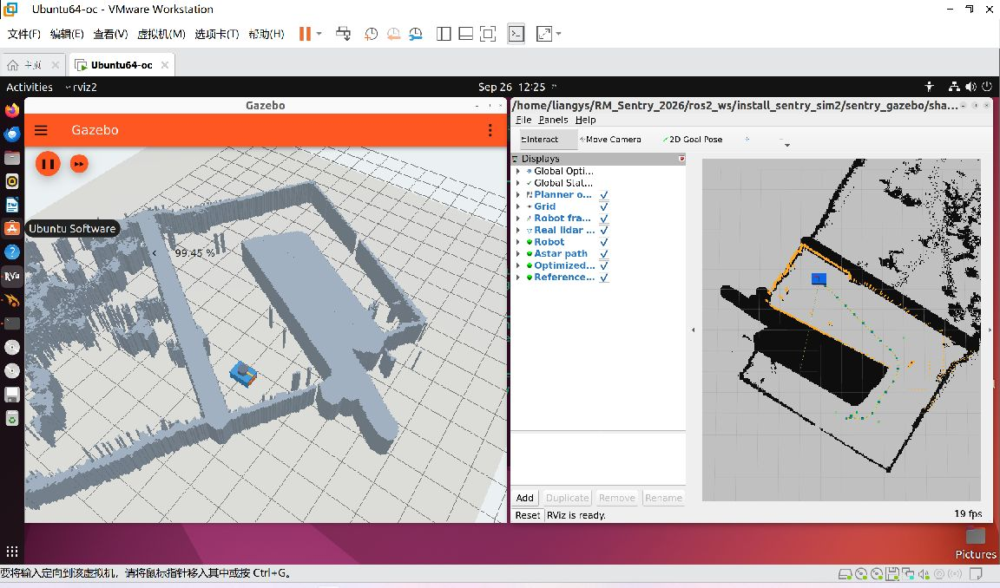

<!-- 文件用途：记录第二阶段真实运行证据、验收门槛、未通过项及复现方式。 -->

# 第二阶段验收报告（2026-09-26）

**结论：场景、真实点云与规划展示已接通，第二阶段整体尚未通过验收。**
M0、M1 通过；M2 可以点击目标并展示真实规划输出，但严格轨迹验收仅 6/15 通过。
M3 已完成运行、回归、录像和材料归档，不能替代未通过的规划项。

本次没有修改生产地图、规划/跟踪算法或消息结构，没有启动自动跟踪、决策、MCU、HDL 或 Point-LIO。
机器人由键盘控制；实际位置来自 Gazebo，点云来自 gpu_lidar 对实际场景的观测。
分支为 feat/20260926-sentry-sim-part2，基线 ac6882e；不自动推送、创建 PR 或合并。

## 环境与运行范围

VMware Ubuntu 22.04.5，4 vCPU、12 GiB 内存，ROS 2 Humble、Gazebo Fortress 6.18.0；
llvmpipe 软件渲染、Ogre2、XWayland。Gazebo 与 RViz 同时可见，没有用无界面结果代替图形验收。
按用户要求，GNOME idle-delay=0、idle-dim=false，持久关闭自动熄屏和空闲变暗。
本阶段额外安装 wmctrl 1.07-7build1 仅用于窗口摆放；不需要独立显卡即可运行当前简化配置，
这不代表以后加入 MPC、定位或高密度点云也有足够余量。

## 结果一览

| 项目 | 实测结果 | 状态 / 证据 |
|---|---|---|
| M0 真实雷达 | 360×4，5 Hz；平移 0.4 m、旋转 0.6 rad 后回波变化 | 通过，probe.json |
| 已知墙面测距 | 静止 / 平移 / 旋转后最大误差 0.00809 / 0.00908 / 0.01007 m | 通过，门槛 0.10 m |
| M1 栅格一致性 | 160,000 格全部检查，0 格差异，15,590 个占据格、2162 个合并体 | 通过，map-validation.json |
| 地标一致性 | 3 个地标误差均为 0 m | 通过，门槛 0.05 m |
| 实际云与地图 | 1380 个有效点，至最近占据格中心距离 P95=0.03791 m、最大=0.06204 m | 对齐辅助证据，不替代墙面测距 |
| 点云错误处理 | 缺 TF、错误 frame、时间戳/外参/过滤、拒绝最新 TF 兜底，4 项通过 | cloud-negative.json；隔离 domain 27 的明确合成负例 |
| GUI 点击目标 | 实际鼠标使用 RViz 2D Goal Pose，收到 map 坐标目标和 16 段真实输出 | 通过，gui-goal.json、demo-events.json |
| 正常规划 | 5 组 ×3 全部发布轨迹；严格检查仅 6/15 通过 | **未通过**，planning-cases.json |
| 轨迹端点 | 15 次最大误差 0.005574 m | 通过，门槛 0.15 m |
| 路径安全 | 已检查样本没有进入膨胀占据区，但 9 条轨迹段间跳变不满足采样条件 | **整体不通过；不能宣称连续路径安全已通过** |
| 可修正的占据目标 | (-2.719,1.896) 按原规则修正为 (-2.819,1.996)，实际端点与预期误差 0.00000012 m | 通过，corrected-goal.json |
| 无法修正的占据目标 | (-4.269, 4.846)，未发布新轨迹，日志明确失败 | 通过，unreachable-goal.json |
| 缺定位 | 现有 mock_replan_fsm 隔离负例通过 | planner-negative-check.log；非真实定位验收 |
| 暂停/恢复 | 时钟 813.05 → 813.05，恢复推进；过期运动指令未执行，位移/转角均 0 | 通过，pause-resume.json、lifecycle-stop.json |
| 停止/重启 | 10 个进程退出，相关发布者归零；重启 1 辆机器人，正确出生点 | 功能检查通过；RViz 一次退出异常另记 |
| 第一阶段回归 | 34 项通过：运动反馈、键盘、限幅、超时、暂停等 | stage1-regression/motion.json |
| 旧规划器单元测试 | trajectory_generation 的既有 C++ 测试通过 | regression.log、构建目录 test_legacy_planning.gtest.xml |
| 启动约束 | 3 项通过 | launch-contract.log |
| 完整生产启动测试 | 4 个场景因本阶段最小 overlay 未构建 decision_node 而未能运行 | 环境受限，不计通过；regression.log 保留重复 JUnit 汇总 |

## 地图来源与坐标

源文件为 trajectory_generation/map 下 occfinal.png、bevfinal.png、occtopo.png，
以及 map/map_meta.yaml、config/map_metadata.yaml。五个 SHA-256 全部记录于
[sentry_gazebo 地图清单](../../../ros2_ws/src/sentry_gazebo/config/map_manifest.json)。
启动检查安装后的文件哈希，原文件不覆盖。

400×400、0.05 m/格、20×20 m，下界 (-13.394, -12.079)。
图像第 0 行对应高 y；像素中心 x=lower_x+(column+0.5)×0.05，
y=lower_y+(399-row+0.5)×0.05。原始占据判据为灰度 >10。
使用未膨胀区域挤出 1 m；规划器自己的安全膨胀仍由原算法处理。
BEV 高度图仍被规划器读取，挤出高度不代表真实地形或坡道。

| 图像行、列 | map 中心 x / y（m） | 网格生成误差（m） |
|---|---|---|
| 171, 272 | 0.231 / -0.654 | 0 |
| 211, 140 | -6.369 / -2.654 | 0 |
| 271, 243 | -1.219 / -5.654 | 0 |

## 五组规划检查与失败定位

固定 planner.test_random_seed=7，从现有工具计算的同一自由连通域选择五组点。
每次使用 Gazebo set_pose 移动真实实体并等待真实定位反馈，再发布 /goal，排除旧轨迹消息。
对每段三次多项式用导数上界控制段内采样间距不超过 0.02 m，并把段间连接处纳入最大相邻距离检查；
占据检查与现有规划器整数膨胀半径规则保持一致。阈值没有因失败而放宽。
脚本在保存全部结果后对不通过项返回非零。

| 组 | 起点 → 目标（m） | 通过次数 | 最大相邻采样距离（m） |
|---|---|---|---|
| 1 | (-0.919,-4.454) → (-2.719,1.946) | 0/3 | 0.08828 |
| 2 | (-2.719,1.946) → (-0.919,-4.454) | 3/3 | 0.01854 |
| 3 | (-1.419,-4.154) → (-3.219,2.146) | 0/3 | 0.05885 |
| 4 | (-1.919,-3.804) → (-3.719,2.096) | 0/3 | 0.11933 |
| 5 | (-2.919,-3.104) → (-4.719,1.096) | 3/3 | 0.01682 |

源码检查指向 reference_path.cpp：可行性检查和总时长截断会修改段时长，
退出前可能没有按最终时长重算多项式系数。当前属于原因假设，未通过修复后回归确认。
[问题记录](KNOWN_ISSUES.md) 给出具体修复边界与回归要求。
原计划明确不改规划核心算法，所以保留原算法并如实报告；修复前不进入自动跟踪验收。

## 图形性能

最终目标箭头、材质和 Marker 配置下，双 GUI 连续运行 310.001 秒：
平均实时率 0.99956，最低五秒采样实时率 0.99322，点云 5.00 Hz（仿真时间）。
仿真启动进程树 10 个进程，RSS 合计采样峰值 1526.41 MiB（约 1.49 GiB），
CPU 平均 355.00%（单核为 100%，相当于 4 核总容量约 88.75%）。
CPU 并不宽裕；RSS 为每 5 秒采样值，不能保证捕获瞬时峰值。最终记录见 performance-goal-display.json；此前一次 310 秒测量保留于 planning-performance.json。

保留的警告/异常：
- RViz OccupancyGrid GLSL 报 sampler 类型共享 texture unit；实际画面可见地图，未把日志写为无错误。
- Gazebo Qt WorldStats 绑定循环、请求 8×抗锯齿不支持并回落到 0、libEGL 软件渲染提示。
- MINCO 出现线搜索达到上限的消息，仍发布轨迹；轨迹正确性以逐条验收为准。
- Ctrl+C 后一次 RViz 出现 corrupted double-linked list、exit -6；进程与发布者已清空，
  后续重启成功。退出崩溃尚未根因定位，不承诺无崩溃生命周期。
- 另一轮退出在 5 秒后由 launch 升级到 SIGTERM，新点云/地图节点曾因 ExternalShutdownException 返回 1；
  已补充退出异常处理，隔离 domain 29 验证 SIGTERM 后两节点均返回 0，见 shutdown-handler.json。
- 最初点云结构化字段读取方式不兼容 ring 字段，及网格缺法线发白、Marker 配置字段不正确，
  已修正并重新实测；历史日志保留，不作为最终通过证据。

## 复现与交付

启动、键盘和停止方法见 [README](README.md)。QA 另开终端，先设置：

~~~bash
cd /home/liangys/RM_Sentry_2026
source /opt/ros/humble/setup.bash
source ros2_ws/install_sentry_sim2/setup.bash
export ROS_DOMAIN_ID=26 ROS_LOCALHOST_ONLY=1 IGN_PARTITION=sentry_basic_liangys_26
# 当前规划场景：检查几何、云和出生点（先重启确保默认出生点）
python3 ros2_ws/src/sentry_gazebo/scripts/validate_map.py
# 将移动仿真实体并执行全部 15 次；当前预期以非零退出，具体结果见 JSON
python3 ros2_ws/src/sentry_gazebo/scripts/planning_check.py
# 明确隔离的负例，不将合成点云接入真实演示
ROS_DOMAIN_ID=27 python3 ros2_ws/src/sentry_gazebo/scripts/cloud_negative_check.py
~~~

性能：以实际 ros2 launch 进程 PID 为参数运行 runtime_monitor.py --pid PID --duration 310 --output 输出路径。
墙面测距：停止规划场景，使用 probe 模式启动后运行 probe_check.py。
第一阶段回归：停止第二阶段，使用 gazebo_basic.sh 启动后运行 acceptance.py；
它会写第一阶段证据目录，复验前归档原记录。本次通过内存中仅替换输出目录保留了旧证据。
暂停检查使用原 acceptance.py 的 test_pause_resume，仅将 world 名从 sentry_basic 替换为 sentry_planning。
停止验证向本次 launch PID 发 SIGINT，等待进程树退出并确认 ROS 发布者归零；
重启验证 scene/info 仅有一个 sentry 实体，确认定位与 /clock 各一位发布者。

[89.8 秒演示视频](demo.mp4) 为实际双窗口录制，包含手动旋转/平移、回波变化、
鼠标点击目标及真实输出；片尾明确注明未通过的连续性问题。字幕源 demo.ass、原始录制和事件时间戳均保留。
[五页汇报提纲](TEAM_REPORT.md) 与 [第三阶段交接](HANDOFF.md) 可直接用于队会。
录像完成后新增持久目标箭头，最终截图为 evidence/stage2-goal-display.png；视频内容仍是真实集成链路。
未完成项为轨迹连续性修复及复验、RViz 退出异常定位；自动到点、真实定位、坡道与碰撞动力学不在本阶段范围。
