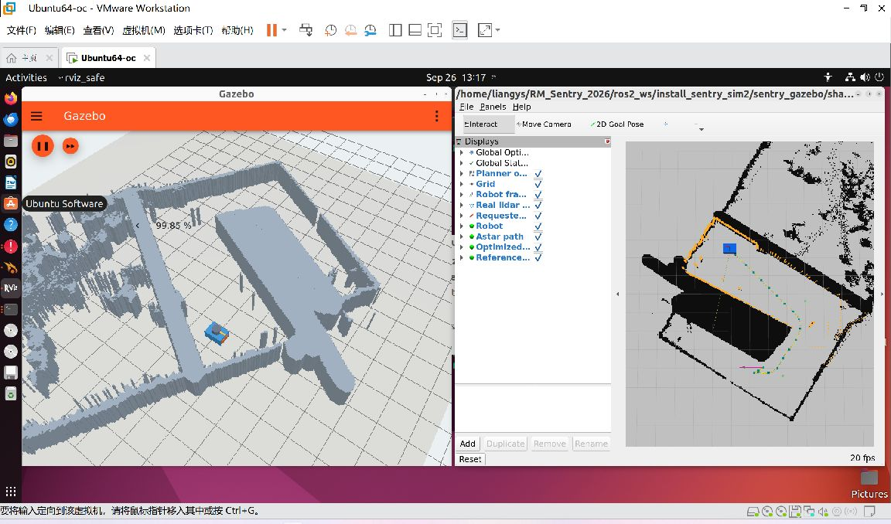

<!-- 文件用途：汇总第二阶段修复后的真实验收结果，并保留历史失败与范围边界。 -->

# 第二阶段验收报告（2026-09-26，修复后）

**结论：第二阶段“地图—真实点云—目标—全局轨迹展示”验收通过。**
五组起终点各三次，15/15 通过；未接入自动跟踪、自动到点或真实定位。
用户在发现问题后明确授权“有问题就修复”，因此本次对规划器时间分配和 RViz 退出处理作了有限修复。
消息结构、生产地图、跟踪控制算法保持不变，没有启动 MPC、决策、MCU、HDL 或 Point-LIO。

原始失败仍在 [修复前报告](ACCEPTANCE-before-fix.md)、planning-cases-before-fix.json 和 Git 历史中，
不能用本报告覆盖“此前 9/15 失败”的事实。

## 关键结果

| 验收项 | 修复后结果 | 证据 |
|---|---|---|
| 五组 × 三次规划 | 15/15 通过 | planning-cases.json、fixed-planning-summary.json |
| 端点误差 | 最大 0.000000140 m，门槛 0.15 m | 完整多项式系数和时长均归档 |
| 相邻检查点距离 | 最大 0.019421 m，门槛 0.025 m | 根据导数上界确定段内采样密度，并检查段间连接 |
| 占据检查 | 15 次所有采样点均未进入原规划器膨胀占据区 | 与现有整数膨胀半径规则一致 |
| 段间位置 / 速度连续性 | 最大 0.000000464 m / 0.000000141 m/s | 发布消息为浮点数，另有双精度单元回归 |
| 加速度 | 每段两端的理论峰值最大 3.977958 m/s²，小于配置 4 | 三次多项式加速度为仿射函数，范数峰值在端点 |
| 速度 | 根据速度平方导数的实根检查极值，最大约 2.3173 m/s，小于配置 2.5 | 跟踪前仍需与仿真 0.5 m/s 限幅协调 |
| 地图一致性 | 160,000 格全查，0 格差异；三个地标误差均 0 m | map-validation.json |
| 雷达真实性 | 360×4，5 Hz；平移 0.4 m、转动 0.6 rad 后回波变化 | probe.json |
| 已知墙面测距 | 最大误差 0.010074 m，小于 0.10 m | 静止、平移、旋转三种状态 |
| 点云异常 | 缺测量时刻 TF、错误 frame、无效点及最新 TF 兜底检查通过 | domain 27 合成负例，cloud-negative.json |
| 占据区目标 | 可修正目标按既有两格邻域规则修正，不可修正目标明确失败 | corrected-goal.json、unreachable-goal.json |
| 缺定位与动态云负例 | 旧 FSM 负例在修复后重新通过，3 次预期输出 | domain 28，planner-negative-fixed-check.log |
| C++ 回归 | 8/8 通过，含原地图规划 2 项、新增时间/连续性/失败处理 6 项 | feasibility-tests.xml / .log |
| 暂停、恢复、停止、重启 | 无过期运动、发布者归零、单机器人重启 | pause-resume.json、lifecycle-*.json |
| RViz 退出 | 连续 3 轮短运行及 310 秒长运行后均正常，无残留 | orderly-shutdown.json |
| 第一阶段回归 | 按最新源码重建后，34/34 项运动与安全检查通过 | stage1-after-fix/motion.json、stage1-fixed-regression.log |
| 双 GUI 性能 | 310.004 秒，平均 RTF 0.99840，最低 0.96569，5 Hz；RSS 峰值 1517.15 MiB，CPU 337.34%（单核口径） | fixed-performance.json |

性能统计覆盖仿真启动进程树中的 10 个进程；CPU 的 100% 表示一个核，
RSS 每 5 秒取样，不能保证捕捉瞬时峰值。窗口保持可见，使用 llvmpipe 软件渲染，
没有用无界面结果替代图形验收。运行平台为 VMware Ubuntu 22.04.5、4 vCPU、12 GiB、
ROS 2 Humble、Fortress 6.18.0。

## 地图来源与坐标

以 trajectory_generation/map 中 occfinal.png、bevfinal.png、occtopo.png 及两份共享元数据为依据，
源文件与 SHA-256 未变。完整哈希见 [map_manifest.json](../../../ros2_ws/src/sentry_gazebo/config/map_manifest.json)。

400×400、0.05 m/格、20×20 m，下界 (-13.394,-12.079)。
像素中心 x=lower_x+(column+0.5)×0.05；y=lower_y+(399-row+0.5)×0.05。
原始占据灰度 >10，15,590 个占据格合并为 2162 个立体障碍，不挤出规划器的安全膨胀区。
出生点 (-0.919,-4.454)、航向零，基线目标 (-2.719,1.946)。

| 地标图像行、列 | map 中心 x / y（m） | 生成误差（m） |
|---|---|---|
| 171,272 | 0.231 / -0.654 | 0 |
| 211,140 | -6.369 / -2.654 | 0 |
| 271,243 | -1.219 / -5.654 | 0 |

1 m 挤出高度仅服务二维轮廓和观测；原 BEV 仍被规划器读取，
不宣称完成真实地形、坡道、多层通行或碰撞动力学验证。
1380 个实际有效点到占据格中心距离 P95=0.03791 m、最大=0.06204 m，
这是对齐辅助指标，墙面测距另行验收。

## 修复内容与回归边界

原实现会在最后一次可行性检查后修改段时长，却继续发布旧系数，导致最大约 0.12 m 的段间跳变。
只重算一次系数后，连续性虽已恢复，实际加速度仍达到 8.03 m/s²，暴露了三次迭代提前退出的问题。

最终修改：
1. 按每段两端检查理论最大加速度，调整时长后重新求解，最多 64 轮；未收敛或输入无效时清空结果并拒绝轨迹。
2. 只有时长不再变化且系数有限时才输出，保证系数与发布时长一致。
3. 移除压缩物理时长到 30 秒的做法，改为位置/速度显示最多 600 点，覆盖完整轨迹并包含终点。
4. 修复单段路径访问不存在相邻段的问题，保留实际初始速度边界。

测试先在旧实现复现四项失败，再验证最终八项通过。
15 次实际发布消息已归档，并以双精度复核速度极值及加速度；没有重新合成轨迹作为验收输入。
外部时长、普通分配、长轨迹、单段、无效/未收敛输入、非零初速度均有回归。
跟踪核心未改；新的参考速度采样与位置采样采用相同时间网格，显示点数上限不会改写消息内物理时长。

RViz 崩溃转储显示在 Qt 更新绘制期间进入 Mesa/LLVM 分配并触发堆错误；
这定位了发生位置，不能单凭栈回溯证明所有堆损坏的来源。
新增 rviz_safe 入口复用已安装 RViz 的窗口、插件与配置，只将 SIGINT/SIGTERM 排到 Qt 主线程：
先停止渲染定时器、退出事件循环，再执行正常 ROS/Ogre 清理，不屏蔽异常退出码。
连续三轮及最终 310 秒运行后的退出结果均为正常，见 orderly-shutdown.json 和 fixed-long-run-stop.json。参考已安装接口及
[上游 VisualizerApp 生命周期](https://github.com/ros2/rviz/blob/humble/rviz_common/src/rviz_common/visualizer_app.cpp)。
仿真适配器同时处理 ROS ExternalShutdownException，避免正常 SIGTERM 被记录为异常。

## 保留的限制与日志

- RViz 地图着色器 sampler、Gazebo EGL / 抗锯齿回落、Qt 绑定循环、MINCO 线搜索等日志仍保留；
  实际地图、点云和轨迹均可见，不宣称“日志完全无警告”。
- 第一阶段修复后首次复验因输出目录未预建而中断；创建目录后未改测试逻辑，完整复跑 34/34 通过，历史片段和说明保留。
- 完整生产启动的四个场景因最小 overlay 未构建 decision_node 而未运行成功；这不是本阶段独立仿真入口失败，也不计为通过。
- 暂停/停止工具必须匹配启动方式：真实终端 Ctrl+C 给前台进程组发信号；交互 launch 只收到父进程 SIGINT 的旧 QA 方法会在 5 秒后升级 SIGTERM。已改用受控非交互启动或验证过的本任务进程组。
- 当前性能有一定余量，但不能据此保证新增 MPC、真实定位或更高点云密度后的性能。
- 不把本次三轮无崩溃扩大为任意图形驱动环境下无崩溃的承诺。

## 复现与交付

[README](README.md) 提供启动、键盘及 Ctrl+C 停止命令，原第一阶段入口保留。

~~~bash
cd /home/liangys/RM_Sentry_2026
bash scripts/gazebo_planning.sh build
# 在 Ubuntu 桌面终端启动
bash scripts/gazebo_planning.sh
# 另开终端，先配置测试环境
source /opt/ros/humble/setup.bash
source ros2_ws/install_sentry_sim2/setup.bash
export ROS_DOMAIN_ID=26 ROS_LOCALHOST_ONLY=1 IGN_PARTITION=sentry_basic_liangys_26
python3 ros2_ws/src/sentry_gazebo/scripts/validate_map.py
python3 ros2_ws/src/sentry_gazebo/scripts/planning_check.py
ROS_DOMAIN_ID=27 python3 ros2_ws/src/sentry_gazebo/scripts/cloud_negative_check.py
ros2_ws/build_sentry_sim2/trajectory_generation/test_legacy_planning
~~~

planning_check 会移动真实仿真实体并恢复默认出生点；失败返回非零并保存完整结果。
validate_map 要求默认出生点，移动演示后先重启。
性能使用 runtime_monitor.py --pid 实际启动PID --duration 310 --output 输出文件；
墙面测距使用 probe 模式与 probe_check.py。所有传感器观测均来自 Gazebo，不用地图拼接伪点云。

[修复后 90 秒实录](demo.mp4) 展示手动旋转、前进、点云变化、RViz 鼠标点击和真实规划结果；
demo-before-fix.mp4 保留修复前实录，不能作为当前版本结果。
[五页队会提纲](TEAM_REPORT.md) 与 [第三阶段交接清单](HANDOFF.md) 已同步。
Ubuntu 不自动熄屏与不空闲变暗设置保持生效。
